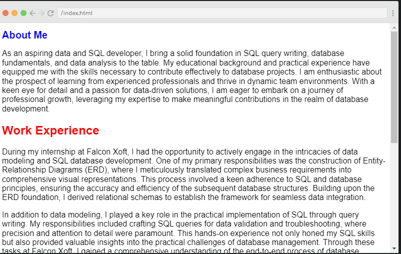
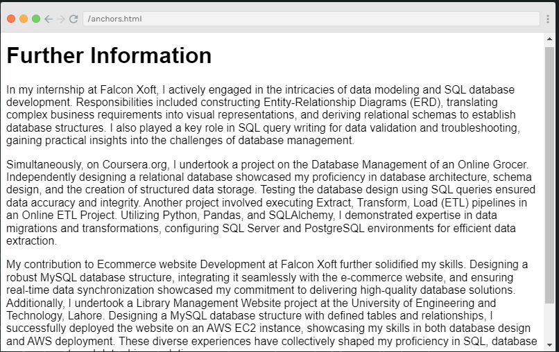

# Simple HTML-CSS Project

## Introduction

This HTML/CSS project comprises two files: `index.html` and `anchors.html`, each showcasing different aspects of web development. The project provides information about an individual, their work experience, and various projects. The styling is enhanced through inline CSS to customize the appearance of the content.

## File Descriptions

### 1. `index.html`

The `index.html` file serves as the main page presenting information about the individual. It includes:

- A large, stylized title about the individual.
- An introductory paragraph highlighting the person's skills and aspirations.
- Sections on work experience, detailing tasks and responsibilities.
- A section on projects, summarizing key achievements.
- A link to an additional page for more detailed information (`anchors.html`).

### 2. `anchors.html`

The `anchors.html` file provides further information about the individual's experiences and projects. It includes:

- A section expanding on the individual's internship experience at Falcon Xoft.
- Details about projects related to the Database Management of an Online Grocer, Ecommerce Website Development, and a Library Management Website.
- A link back to the homepage (`index.html`).

## Styling

CSS styling is incorporated directly into the HTML files using inline styles. Notable styling choices include:

- Color change and font size adjustment for the main title (`h1`).
- Color change for secondary titles (`h2`).
- Font size adjustment for paragraphs.
- A green-colored link for increased visibility.

## Output Images

For visual representations of the pages, refer to the following links:

- 
- 

## How to Use

Simply open the HTML files (`index.html` and `anchors.html`) in a web browser to view the content. The navigation between pages is facilitated by the provided links.

Feel free to explore and learn more about the individual's background, experiences, and projects!
